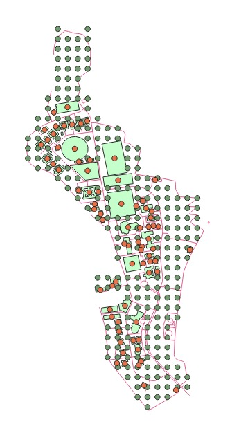
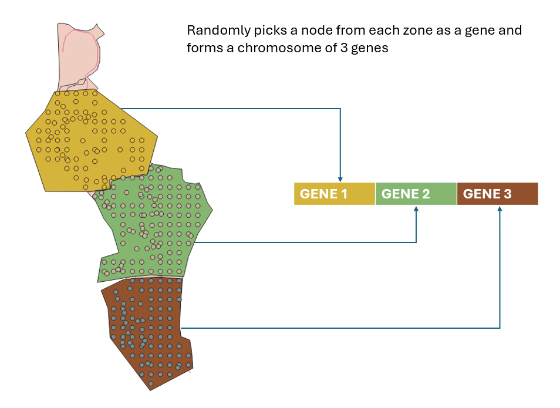

# Finding Optimal Location of Hospitals using Hill Climbing and Genetic Algorithms in IISERB campus

## Table of Contents
1. Project Overview
2. Algorithm Details
   - Hill Climbing Algorithm
   - Genetic Algorithm
3. Installation Requirements
   - Prerequisites
   - Required Libraries
4. Usage Instructions
   - Step 1: Data Preparation
   - Step 2: Graph Initialization
   - Step 3: Algorithm Execution
   - Step 4: Result Visualization
5. Running the Code
6. Contributors

## Project Overview
This project is dedicated to identifying the most optimal locations for constructing new hospitals on the IISER Bhopal campus. By applying the hill climbing algorithm with random restarts and Genetic Algorithm, this project analyzes spatial data to pinpoint locations that optimize accessibility and efficiency for healthcare services.

# Algorithm Details
The program uses hill climbing and genetic algorithm to find out the optimal locations for a medical facility/hospital inside IISERB campus.

## Hill Climbing Algorithm

Hill climbing is a local search algorithm used for optimization problems. It starts with an initial point and iteratively moves to neighbors that optimize the objective function until a local optimum is reached. In our case, the objective function is the average cost of edge weights (road distances) to neighboring nodes. The algorithm selects the neighbor with the lowest average cost.

- ### Random Restarts

To escape local optimum solutions, random restarts are incorporated into the hill climb algorithm. Upon reaching a local optimum, the algorithm restarts from a randomly chosen initial node and continues the search. This enhances exploration of the solution space, increasing the likelihood of finding a global optimum.

We applied the proposed hill climbing algorithm with random restarts to the real-world dataset representing a network graph of IISER Bhopal. The dataset consists of nodes representing buildings and blank points, with edges indicating connectivity between them. The cost associated with each edge represents the road-distance or transportation cost between nodes.

We start with initiating the nodes of the graph with the given coordinates and the road distance as the edge weights. The objective of taking the average distance is our objective function.

We run the algorithm for 25 random restarts, and for every iteration, we print the optimum location, coordinates, final average cost, initial starting point, initial average cost, and the type of point (whether it is a blank point or a building centroid). The final optimum location is the optimal location among all the other optima with the least average cost. We then plot the optimal location on the graph with a marker for identification.

## Genetic Algorithm

Genetic algorithms are evolutionary techniques for optimization, mimicking natural selection. Similar to Hill Climbing, we implemented a genetic algorithm on the IISER Bhopal dataset to optimize hospital placement. The genetic algorithm uses a population of chromosomes, each consisting of nodes selected from predefined regions (Academic, Faculty, and Student areas), representing potential hospital locations.

- ### Chromosome Representation

Each chromosome is composed of three genes, corresponding to randomly selected nodes from each of the three specified campus regions. This design helps capture diverse geographic and functional aspects within the campus.

- ### Fitness Calculation

The fitness of each chromosome is assessed based on the sum of the distances between the nodes it includes, aiming for minimal travel time across the campus.

- ### Genetic Operations

Our population undergoes genetic operations such as selection, crossover, and mutation. Chromosomes are initially ranked by their fitness, and pairs are selected for crossover. Offspring from crossover inherit traits from two parent chromosomes, and mutations are introduced to explore new potential solutions.

- ### Algorithm Execution

The genetic algorithm is run over two generations, continually improving the population. Each generation's best chromosome is identified based on the best fitness score.

For a more detailed analysis refer to the [report](URL)

[Learn more about Hill Climbing Algorithm](https://www.geeksforgeeks.org/introduction-hill-climbing-artificial-intelligence/)

[Learn more about Genetic Algorithm](https://www.geeksforgeeks.org/genetic-algorithms/)

## Result Visualization

The optimal locations determined by the hill climbing algorithm and genetic algorithm are visualized on the campus map, highlighting the most trategically beneficial site for a new hospital.

# Code Execution:

## Installation Requirements

### Prerequisites
- Python 3.8 or newer
- pip for installing Python packages

### Required Libraries
Install the following libraries using pip to ensure the project runs smoothly:
- pandas
- networkx
- numpy
- matplotlib
- scipy
- folium
- osmnx
- geopandas

Install the libraries using the requirements.txt file

## Usage Instructions

### Step 1: Data Extraction and Preparation:
The distance matrices were generated using QNEAT3 algorithm to get the road distance between nodes, and the matrices were then stored in csv format.

Prepare your working directory with the necessary CSV files, in this case we have used the following files:

## For Hill Climbing:
- `building_coordinates.csv`: Coordinates of existing structures.
- `modified_blank_coordinates.csv`: Coordinates for potential hospital sites.
- `final_networkdist_blank_to_building.csv`: Distances from potential sites to existing structures.
- `final_networkdist_building_to_building.csv`: Distances between existing structures.

## For Genetic Algorithm:
- `student.csv`: Coordinates of nodes inside the student zone
- `academic.csv`: Coordinates of nodes inside the academic zone
- `faculty.csv`: Coordinates of nodes inside the faculty zone

- `student_dist.csv`: Distances between all nodes in student zone
- `academic_dist.csv`: Distances between all nodes in academic zone
- `faculty_dist.csv`: Distances between all nodes in faculty zone

### Step 2: Graph Initialization
Initializes a graph in which nodes symbolize existing and potential structures, and edges depict distances or connections.

### Step 3: Algorithm Execution

#### Hill Climbing
Implements the hill climbing algorithm with random restarts to find optimal hospital locations, avoiding local optima for a broader solution search and finally giving the optimal location found within the specified number of iterations.

#### Genetic Algorithm
Implements Genetic algorithm with chromosome creation using random nodes from each zone, sorting them according to their fitness values, performing crossovers and mutations and finally giving the chromosome with the best fitness value obtained within a specified number of generations.

### Step 4: Result Visualization
Displays a graph illustrating the campus layout, existing infrastructure, proposed sites, and the selected optimal locations for hospitals. An html file can also be generated to visualize the results on the world map.

## Running the Code
To run the code follow the following steps:
1. Copy the repository in your local machine.
2. Install the required libraries.
3. Make sure all the csv files are in the same directory as the ipynb files. If you wish you use your own csv files, replace the existing ones with your own files.
4. Run the code cells in the notebook sequentially to execute the hill climbing or genetic algorithm.
5. If you wish to run the code in Google Collab, upload all the necessary files and execute the code similarly.

## Contributors
- Manish Gayen
- Sayandeep Pal
- Srijan Pradhan
- Prajjwal Sanskar

If you wish to collaborate to perform a similar task for a different location, please contact the authors.
